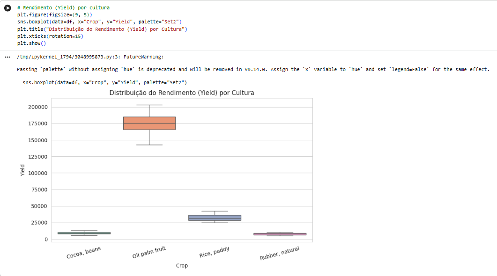
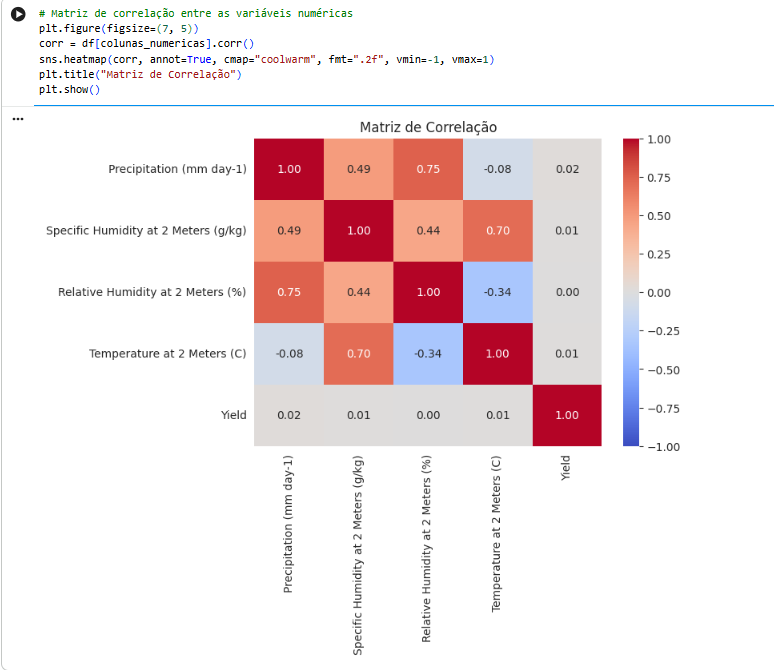
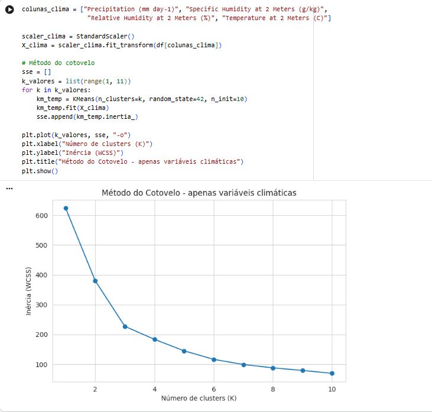
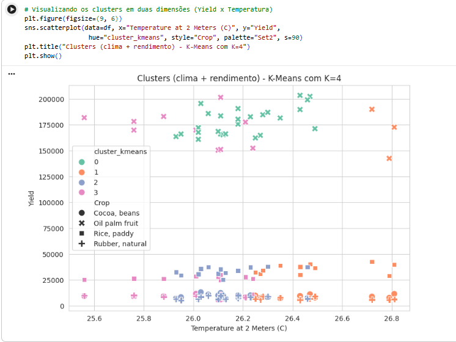
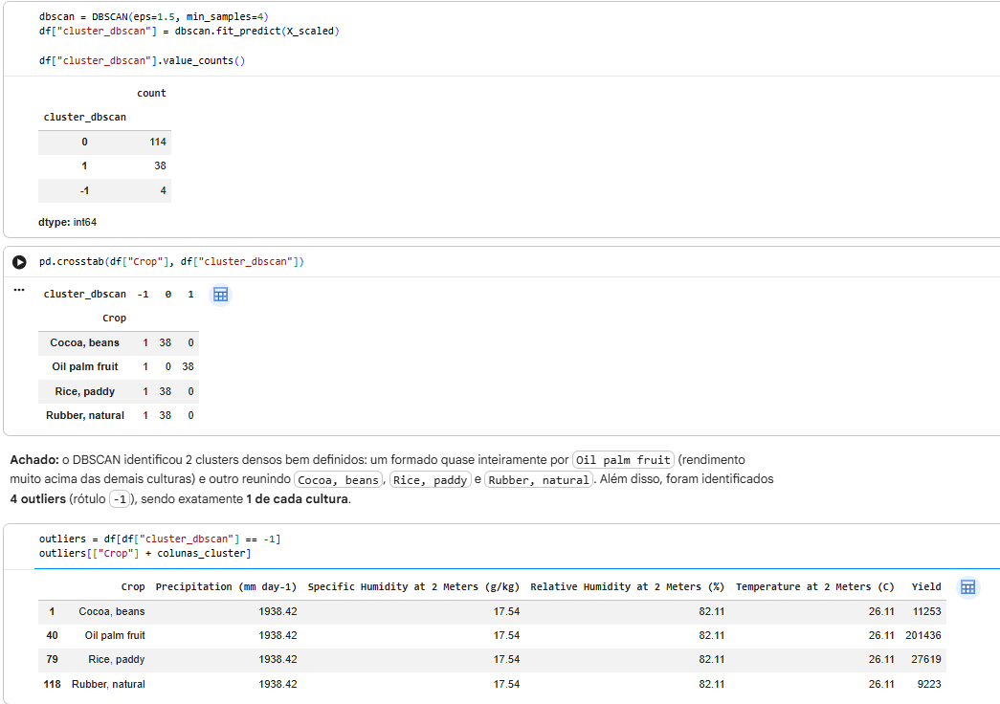
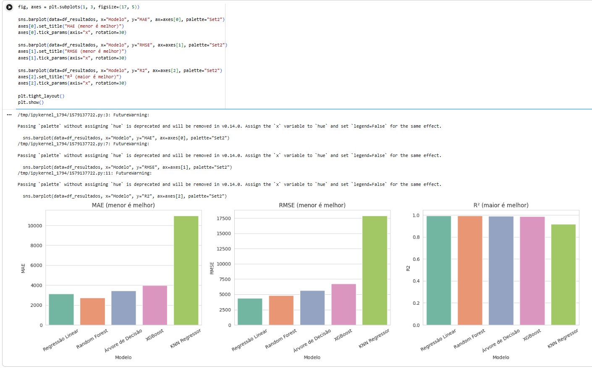
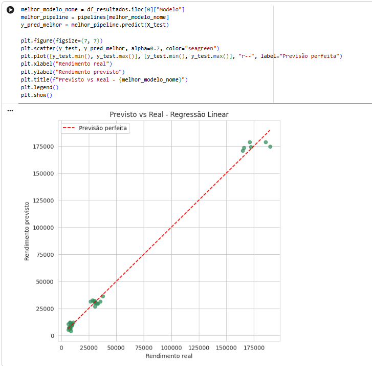
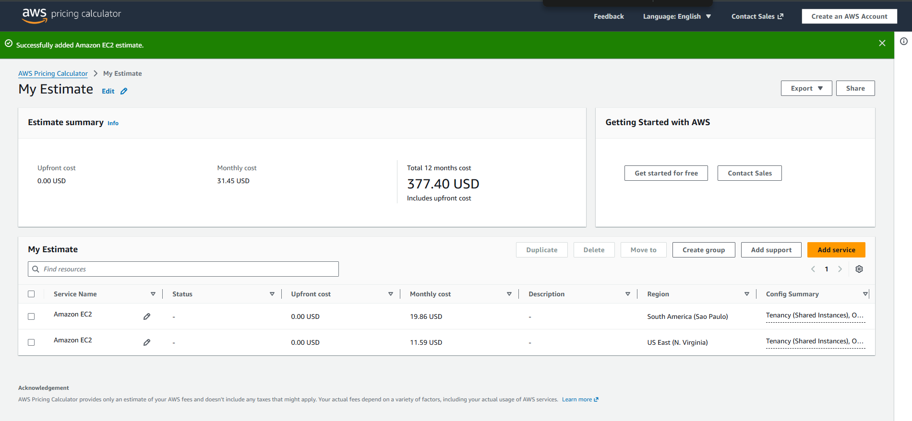

# FIAP - Faculdade de Informática e Administração Paulista

# 🌱 FarmTech Solutions - Machine Learning e Computação em Nuvem

---

## 👨‍🎓 Integrantes

* Natalia de Lima Faro - RM 568610

---

## 📜 Descrição

Este projeto tem como objetivo prestar serviços de Inteligência Artificial para a FarmTech Solutions, uma fazenda de médio porte (~200 hectares) que produz diferentes culturas agrícolas.

A solução foi desenvolvida utilizando a base de dados `crop_yield.csv`, contendo informações climáticas (precipitação, umidade específica, umidade relativa e temperatura) e o rendimento (`Yield`) de 4 culturas: Cocoa (cacau), Oil palm fruit (dendê), Rice paddy (arroz) e Rubber (borracha).

A partir desses dados, foi realizada uma análise exploratória completa, seguida de clusterização (K-Means e DBSCAN) para identificar tendências de produtividade e outliers, e do treinamento e comparação de 5 modelos de Machine Learning (Regressão Linear, KNN, Árvore de Decisão, Random Forest e XGBoost) para prever o rendimento da safra.

Complementarmente, foi realizada uma análise de custos na AWS, comparando a hospedagem da solução entre as regiões de São Paulo (Brasil) e Norte da Virgínia (EUA).

O projeto demonstra a aplicação prática de Machine Learning e Computação em Nuvem no Agronegócio, auxiliando produtores rurais na tomada de decisão baseada em dados.

---

## 📁 Estrutura de pastas

```text
FarmTech_Fase5
│
├── data
│   └── crop_yield.csv
│
├── docs
│   ├── boxplot_rendimento_cultura.png
│   ├── matriz_correlacao.png
│   ├── metodo_cotovelo.png
│   ├── clusters_kmeans.png
│   ├── outliers_dbscan.png
│   ├── comparacao_modelos.png
│   ├── previsto_vs_real.png
│   └── aws_pricing_calculator.png
│
├── document
│   └── entrega2_aws.pdf
│
├── src
│   └── Natalia_Faro_rm568610_pbl_fase5.ipynb
│
└── README.md
```

---

## 🔧 Como executar o código

### Pré-requisitos

* Conta Google (para uso do Google Colab) **ou** Python 3 instalado localmente
* Bibliotecas:

  * pandas
  * numpy
  * scikit-learn
  * xgboost
  * matplotlib
  * seaborn

### Passo a passo

Baixe ou clone o repositório.

Instale as dependências (caso rode localmente):

```bash
pip install pandas numpy scikit-learn xgboost matplotlib seaborn
```

Abra o notebook:

```text
src/Natalia_Faro_rm568610_pbl_fase5.ipynb
```

Certifique-se de que o arquivo `data/crop_yield.csv` está acessível ao notebook (no Colab, faça o upload manualmente na sessão).

Execute todas as células sequencialmente (**Ambiente de execução → Executar tudo**, no Colab).

---

## ⚙️ Funcionalidades

* Análise exploratória da base `crop_yield.csv` (estatísticas descritivas, distribuições, correlações).
* Clusterização com K-Means (método do cotovelo para definição de K).
* Detecção de outliers com DBSCAN.
* Treinamento de 5 modelos preditivos de regressão, com pipeline (`ColumnTransformer` + `StandardScaler` + `OneHotEncoder`).
* Cálculo das métricas MAE, RMSE e R² para cada modelo.
* Comparação visual entre os modelos (gráficos de barras e previsto vs. real).
* Estimativa e comparação de custos AWS (São Paulo x Norte da Virgínia).

---

## 🚀 Tecnologias Utilizadas

* Python
* Pandas
* NumPy
* Scikit-Learn
* XGBoost
* Matplotlib
* Seaborn
* Google Colab
* AWS Pricing Calculator
* GitHub

---

## 🔍 Análise Exploratória e Clusterização

A base contém 156 registros (39 por cultura), sem valores nulos. Um achado importante da análise: **as 4 culturas compartilham exatamente os mesmos dados climáticos** (mesma série de 39 observações), o que significa que apenas o rendimento (`Yield`) muda entre elas.

Por esse motivo, a clusterização apenas por variáveis climáticas não separa as culturas. Ao incluir o `Yield` na clusterização, foi possível identificar tendências reais de produtividade, com destaque para a `Oil palm fruit`, que se isola claramente das demais por seu rendimento muito superior.

### Distribuição do rendimento por cultura



### Matriz de correlação entre variáveis climáticas



### Método do Cotovelo (K-Means)



### Clusters formados (K-Means com clima + rendimento)



### Outliers identificados pelo DBSCAN

O DBSCAN identificou 4 outliers (1 por cultura), todos correspondentes à mesma posição temporal na série climática — indício de uma condição climática atípica pontual.



---

## 🤖 Machine Learning

Foram desenvolvidos e comparados 5 modelos de regressão para prever o rendimento (`Yield`) a partir da cultura e das condições climáticas.

### Variáveis de Entrada

* Cultura (`Crop`)
* Precipitação
* Umidade específica
* Umidade relativa
* Temperatura

### Variável Prevista

* Rendimento da safra (`Yield`, em toneladas/hectare)

### Métricas Obtidas

| Modelo | MAE | RMSE | R² |
| --- | ---: | ---: | ---: |
| Regressão Linear | 3.132,80 | 4.394,17 | 0,9950 |
| Random Forest | 2.729,69 | 4.808,27 | 0,9940 |
| Árvore de Decisão | 3.440,69 | 5.640,31 | 0,9918 |
| XGBoost | 3.987,72 | 6.753,67 | 0,9882 |
| KNN Regressor | 10.992,28 | 17.919,44 | 0,9172 |

### Interpretação

Surpreendentemente, a **Regressão Linear** obteve o melhor desempenho entre os 5 modelos. Isso ocorre porque a variável `Crop` é o principal determinante do rendimento, e o `OneHotEncoder` já captura essa relação de forma praticamente linear. O **KNN Regressor** teve desempenho bem inferior, penalizado pela alta dimensionalidade gerada pelo one-hot encoding combinada com uma base pequena (156 registros).





---

## ☁️ Computação em Nuvem (AWS)

Foi realizada uma estimativa de custos (On-Demand, 100% de utilização) na calculadora da AWS para uma instância Linux `t3.micro` (2 vCPUs, 1 GiB de memória, até 5 Gigabit de rede, 50 GB de armazenamento), comparando as regiões de São Paulo (Brasil) e Norte da Virgínia (EUA).

| Região | Custo mensal estimado |
| --- | ---: |
| São Paulo (Brasil) | US$ 19,86 |
| Norte da Virgínia (EUA) | US$ 11,59 |

Embora Norte da Virgínia seja ~71% mais barata, a solução escolhida foi **São Paulo**, priorizando menor latência para os dados dos sensores agrícolas (localizados no Brasil) e maior simplicidade de conformidade com a LGPD.

📄 Justificativa técnica completa: [document/entrega2_aws.pdf](document/entrega2_aws.pdf)



---

## 📊 Conclusão

O projeto demonstrou a integração entre Análise Exploratória, Clusterização e Machine Learning aplicados ao Agronegócio. A investigação crítica dos dados revelou que as variáveis climáticas são compartilhadas entre as culturas, o que moldou toda a análise de clusterização e reforçou a importância da variável `Crop` nos modelos preditivos.

A comparação entre 5 algoritmos distintos, utilizando pipeline de pré-processamento e métricas padronizadas, permitiu identificar a Regressão Linear como o modelo mais eficaz para este cenário — um resultado que reforça a importância de testar múltiplos algoritmos em vez de assumir que modelos mais complexos sempre performam melhor.

Como limitações, destacam-se o tamanho reduzido da base (156 registros) e a ausência de busca de hiperparâmetros, que poderiam ser exploradas em trabalhos futuros.

---

## 🎥 Vídeo Demonstrativo

A apresentação completa do projeto pode ser acessada pelos links abaixo:

🔗 Notebook (Entrega 1): [link do YouTube](#) — *adicionar após gravação*

🔗 Estimativa AWS (Entrega 2): [link do YouTube](#) — *adicionar após gravação*

O vídeo demonstra:

* Estrutura do projeto e organização das pastas.
* Análise exploratória da base `crop_yield.csv`.
* Clusterização com K-Means e detecção de outliers com DBSCAN.
* Treinamento dos 5 modelos de Machine Learning.
* Avaliação das métricas MAE, RMSE e R².
* Comparação de custos AWS entre São Paulo e Norte da Virgínia.

---

## 🗃 Histórico de lançamentos

* 0.1.0 - 2026 - Criação da estrutura inicial do projeto
* 0.2.0 - 2026 - Análise exploratória e clusterização (K-Means/DBSCAN)
* 0.3.0 - 2026 - Treinamento e comparação dos 5 modelos preditivos
* 0.4.0 - 2026 - Estimativa de custos AWS (Entrega 2)

---

## 📋 Licença

MODELO GIT FIAP por FIAP está licenciado sob Attribution 4.0 International.
